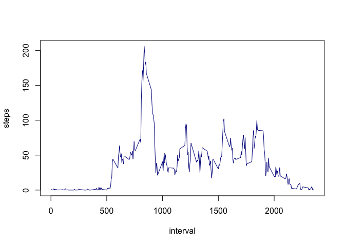

# Reproducible Research: Peer Assessment 1


## Loading and preprocessing the data

```r
unzip("activity.zip")
activity <- read.csv("activity.csv")
str(activity)
```

```
## 'data.frame':	17568 obs. of  3 variables:
##  $ steps   : int  NA NA NA NA NA NA NA NA NA NA ...
##  $ date    : Factor w/ 61 levels "2012-10-01","2012-10-02",..: 1 1 1 1 1 1 1 1 1 1 ...
##  $ interval: int  0 5 10 15 20 25 30 35 40 45 ...
```

```r
activity$date <- as.Date(activity$date)
```

## What is mean total number of steps taken per day?
For this part of the assignment, you can ignore the missing values in the dataset.

1. Make a histogram of the total number of steps taken each day


```r
aggregacti <- aggregate(steps ~ date, data = activity, FUN = sum)
barplot(aggregacti$steps, names.arg = aggregacti$date, col = "lightblue",
        xlab = "Date", ylab = "Number of Steps", 
        main="Total numbers of steps taken per day")           
```

 

2. Calculate and report the mean and median total number of steps taken per day

```r
mean(aggregacti$steps)
```

```
## [1] 10766.19
```


```r
median(aggregacti$steps)
```

```
## [1] 10765
```

## What is the average daily activity pattern?

1. Make a time series plot (i.e. type = "l") of the 5-minute interval (x-axis) and the average number of steps taken, averaged across all days (y-axis)


```r
aggreg_step_interv <- aggregate(steps ~ interval, data = activity, FUN = mean)
plot(aggreg_step_interv, type="l", col = "darkblue")
```

 

2. Which 5-minute interval, on average across all the days in the dataset, contains the maximum number of steps?


## Imputing missing values


## Are there differences in activity patterns between weekdays and weekends?
